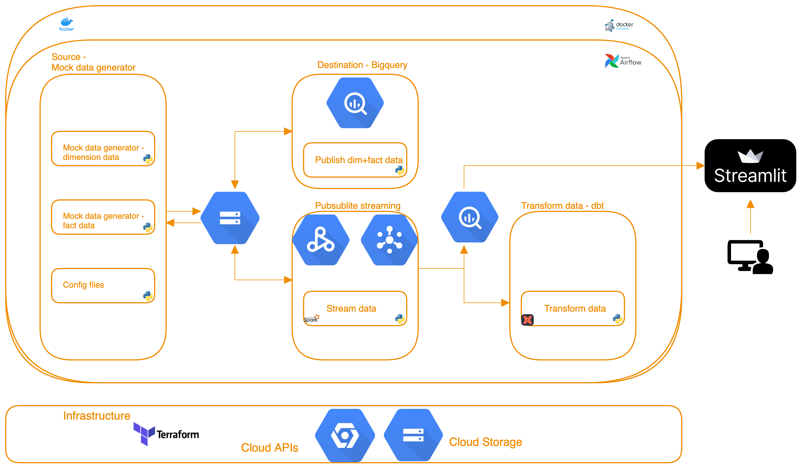
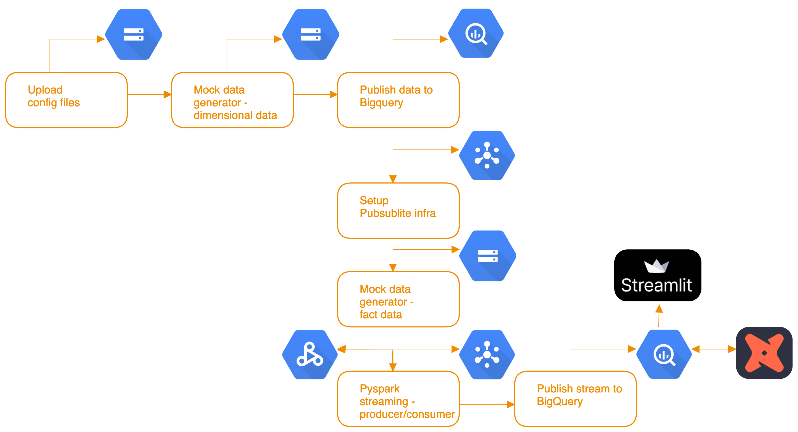

# US E-commerce retail data pipeline - transaction and inventory analysis
This project was created as part of the finale for the DataTalksClub - Data Engineering Zoomcamp 6 week course. The data used for this project
is completely artifical; they were generated using Python scripts.
There are 4 tables in total: 
1) Two dimensional tables which contains `product` and `store` data
2) Two fact tables which contain `inventories` and `transactions` data
In order to create a dashboard, some historical data is generated starting Jan 2024 - March 2024. The Airflow job can be run every hour or so to simulate the generation of transactions and inventories every few seconds.

## Problem Description
The goal of the project is to build an end to end streaming data pipeline that will produce data, aggregated to one second interval, of a fictitious US E-commerce retail giant. The dimensional data and fact data are store in Google Cloud Storage. Pubsublite is used to produce and consume streaming transactions and inventories, which is processed using Apache Spark; the final results are stored in Bigquery and these are transformed using dbt; the analysis is displayed on Streamlit.

## Technology Stack 
The following technologies have been used
- [Google Cloud Storage (GCS)](https://cloud.google.com/storage?hl=en)
- [Google BigQuery](https://cloud.google.com/bigquery?hl=en)
- [Google Pubsublite](https://cloud.google.com/pubsub/lite/docs)
- Terraform<br>
- [Airflow](https://airflow.apache.org/docs/apache-airflow/stable/start.html)
- [Apache Spark](https://spark.apache.org/docs/latest/api/python/user_guide)
- [dbt](https://github.com/dbt-labs/dbt-core)
- [Docker](https://docs.docker.com/get-docker/)
- [Make](https://makefiletutorial.com/)
- [Pipenv](https://pipenv.pypa.io/en/latest/)
- [Streamlit](https://streamlit.io/)

## Data Dictionary
Schema for product
|Field name    |Type     |Description                               | 
|--------------|---------|------------------------------------------|
|product_id    | STRING  |Unique identifier                         |
|name          | STRING  |Product name                              |
|category      | STRING  |Product classification                    |
|base_price    | FLOAT   |Unit price                                |
|supplier_id   | STRING  |Unique supplier identifer                 |

Schema for store
|Field name    |Type     |Description                               | 
|--------------|---------|------------------------------------------|
|store_id      | STRING  |Unique identifier                         |
|location      | STRING  |Store location                            |
|size          | INT     |Store size                                |
|manager       | STRING  |Name of manager                           |

Schema for transaction
|Field name    |Type     |Description                               | 
|--------------|---------|------------------------------------------|
|transaction_id| STRING  |Unique identifier                         |
|product_id    | STRING  |Product identifier                        |
|timestamp     | STRING  |Time of transaction                       |
|quantity      | INT     |Number of units                           |
|unit_price    | FLOAT   |Price of product                          |
|store_id      | STRING  |Store identifer                           |

Schema for inventory
|Field name     |Type     |Description                               | 
|---------------|---------|------------------------------------------|
|inventory_id   | STRING  |Unique identifier                         |
|product_id     | STRING  |Product identifier                        |
|timestamp      | STRING  |Time of transaction                       |
|quantity_change| INT     |Change in product quantity                |
|store_id       | STRING  |Store identifer                           |


## High level architecture


## End to end data flow chart


## Streamlit demo: US retail dashboard
[](https://us-retail.streamlit.app/)

The data used for this demo is artifically generated using Python scripts

## Steps to reproduce the project
**1.** Prerequisites:
<details>
<summary>Google Cloud Platform Account</summary>

Note - If you have already done these steps then it is not required.

- Sign up for a free account [here](https://cloud.google.com/free/), and enable billing.
- Create your project
- Create a service account under IAM & Admin
- Grant the following roles - Storage Admin + Storage Object Admin + BigQuery Admin
- Click Add keys, and then crete new key. Download the JSON file

</details>

<details>
<summary>Google Cloud SDK - Optional</summary>

Installation instruction [here](https://cloud.google.com/sdk/docs/install-sdk).

</details>

Enable Google authentication - Optional
```shell
export GOOGLE_APPLICATION_CREDENTIALS=<path/to/your/service-account-authkeys>.json
gcloud auth activate-service-account --key-file $GOOGLE_APPLICATION_CREDENTIALS
gcloud auth application-default login
```

<details>
<summary>Install Docker for your OS</summary>

Installation instructions[here](https://docs.docker.com/engine/install/)
</details>

<details>
<summary>Terraform</summary>

You can view the [installation instructions for Terraform here](https://developer.hashicorp.com/terraform/downloads?ajs_aid=f70c2019-1bdc-45f4-85aa-cdd585d465b4&product_intent=terraform)

</details>

**2.**Clone the repository:
```shell
git clone https://github.com/sl2902/retail_data_pipeline.git
```

**3.**Change the working directory:
```shell
cd retail_data_pipeline/
```

**4.** Rename the env.template file to `.env`:
```shell
mv env.template .env
```

4.1 Fill in the blanks to the following variables in the `.env` file and save it:
```shell
project_id=
SERVICE_ACCOUNT_FILENAME=
HOST_GOOGLE_APPLICATION_CREDENTIALS=/path/to/your/${SERVICE_ACCOUNT_FILENAME}
```

**5.** Build and enable the virtual environment:
```shell
make setup
```

**6.** Run docker compose:
```shell
make docker_build
```

6.1 Launch Airflow UI. user - `airflow`. password - `airflow`:
```shell
http://localhost:8080
```

6.2 Run sanity check to see whether the dags are available; there should be 5 dags:
```shell
make dag_list
```

6.3 Create service account in Airflow configuration:
```shell
make add_gcp_service_account_airflow
```

6.4 Load the configuration files:
```shell
make dag_run_upload_config_files_to_gcs
```

6.4.1 Check the status of job either on the CLI or via the Airflow UI:
```shell
make dag_chk_status_upload_config_files_to_gcs
```

6.5 Generate and load dimensional data to BQ:
```shell
make dag_run_load_mock_dim_data_bq
```

6.5.1 Check the status of job either on the CLI or via the Airflow UI:
```shell
make dag_chk_status_load_mock_dim_data_bq
```

6.6 Setup the pub/sub lite infra
```shell
make dag_run_setup_pubsublite_infra
```

6.6.1 Check the status of job either on the CLI or via the Airflow UI:
```shell
make dag_chk_status_setup_pubsublite_infra
```

6.7 Generate transaction and inventory history for 3 months and stream the data
```shell
make dag_run_publish_stream_to_bq
```

6.7.1 Check the status of job either on the CLI or via the Airflow UI:
```shell
make dag_chk_status_publish_stream_to_bq
```

6.8 Transform the data using dbt
```shell
make dag_run_build_dbt_model
```

6.8.1 Check the status of job either on the CLI or via the Airflow UI:
```shell
make dag_chk_status_build_dbt_model
```

6.9 Run the streamlit dashboard
```shell
make run_streamlit
```

6.10 Simulate generating transactions and inventories in real-time and stream the data
```shell
make dag_run_publish_stream_to_bq_sec
```

6.10.1 Check the status of job either on the CLI or via the Airflow UI:
```shell
make dag_chk_status_publish_stream_to_bq_sec
```

6.11 Clean the environment
```shell
make docker_clean
```


